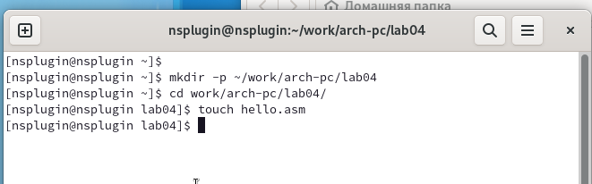
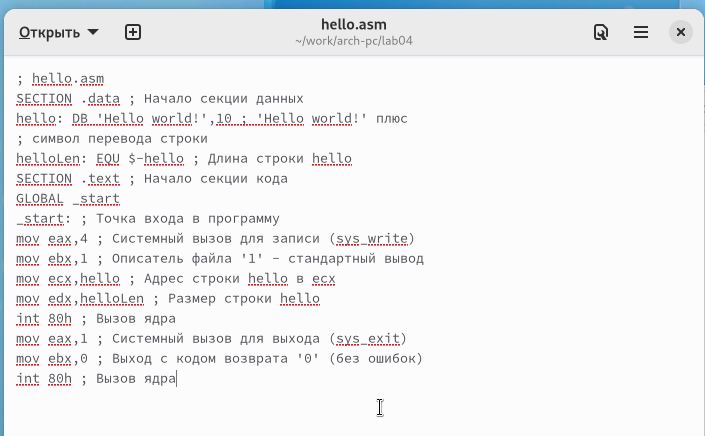
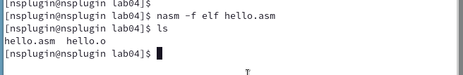
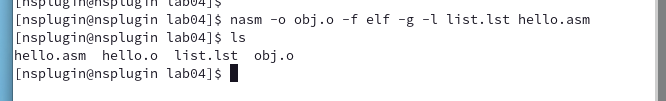
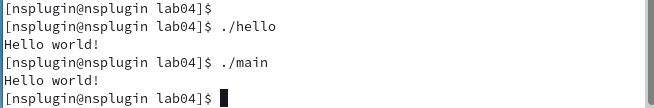
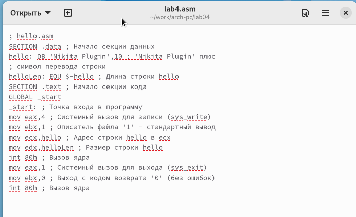
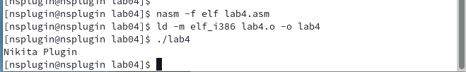

---
## Front matter
title: "Отчёт по лабораторной работе 4"
subtitle: "Дисциплина: архитектура компьютера"
author: "Плугин Никита"

## Generic otions
lang: ru-RU
toc-title: "Содержание"

## Bibliography
bibliography: bib/cite.bib
csl: pandoc/csl/gost-r-7-0-5-2008-numeric.csl

## Pdf output format
toc: true # Table of contents
toc-depth: 2
lof: true # List of figures
lot: true # List of tables
fontsize: 12pt
linestretch: 1.5
papersize: a4
documentclass: scrreprt
## I18n polyglossia
polyglossia-lang:
  name: russian
  options:
	- spelling=modern
	- babelshorthands=true
polyglossia-otherlangs:
  name: english
## I18n babel
babel-lang: russian
babel-otherlangs: english
## Fonts
mainfont: PT Serif
romanfont: PT Serif
sansfont: PT Sans
monofont: PT Mono
mainfontoptions: Ligatures=TeX
romanfontoptions: Ligatures=TeX
sansfontoptions: Ligatures=TeX,Scale=MatchLowercase
monofontoptions: Scale=MatchLowercase,Scale=0.9
## Biblatex
biblatex: true
biblio-style: "gost-numeric"
biblatexoptions:
  - parentracker=true
  - backend=biber
  - hyperref=auto
  - language=auto
  - autolang=other*
  - citestyle=gost-numeric
## Pandoc-crossref LaTeX customization
figureTitle: "Рис."
tableTitle: "Таблица"
listingTitle: "Листинг"
lofTitle: "Список иллюстраций"
lotTitle: "Список таблиц"
lolTitle: "Листинги"
## Misc options
indent: true
header-includes:
  - \usepackage{indentfirst}
  - \usepackage{float} # keep figures where there are in the text
  - \floatplacement{figure}{H} # keep figures where there are in the text
---

# Цель работы

Целью работы является освоение процедуры компиляции и сборки программ, написанных на ассемблере NASM.

# Задания

1. Изучить основы языка Ассемблера

2. Освоить и выполнить процесс компиляции программы на Ассемблере

3. Выполнить самостоятельное задание по изменению программы

# Теоретическое введение

В нашем курсе будет использоваться ассемблер NASM (Netwide Assembler). NASM — это открытый проект ассемблера, версии которого доступны под различные
операционные системы и который позволяет получать объектные файлы для этих систем. В
NASM используется Intel-синтаксис и поддерживаются инструкции x86-64. Типичный формат записи команд NASM имеет вид: 

```[метка:] мнемокод [операнд {, операнд}] [; комментарий]```

Здесь мнемокод — непосредственно мнемоника инструкции процессору, которая являетсяобязательной частью команды. Операндами могут быть числа,данные, адреса регистров или
адреса оперативной памяти. Метка — это идентификатор, с которым ассемблер ассоциирует некоторое число, чаще всего адрес в памяти. Т.о. метка перед командой связана с адресом
данной команды.

# Выполнение лабораторной работы

##  Программа Hello world!

Рассмотрим пример простой программы на языке ассемблера NASM. Традиционно первая
программа выводит приветственное сообщение Hello world! на экран.

1. Создал каталог lab04 командой mkdir, перешел в него с помощью команды cd, создал файл hello.asm. (рис. [-@fig:001])

{ #fig:001 width=70%, height=70% }

2. Открыл файл и написал код программы по заданию.(рис. [-@fig:002])

{ #fig:002 width=70%, height=70% }

В отличие от многих современных высокоуровневых языков программирования, в ассемблерной программе каждая команда располагается на отдельной строке. Размещение
нескольких команд на одной строке недопустимо. Синтаксис ассемблера NASM является
чувствительным к регистру, т.е. есть разница между большими и малыми буквами.

## Транслятор NASM

3. Транслировал файл командой nasm c опцией -f.  (рис. [-@fig:003])

Ключ -f указывает транслятору, что требуется создать
бинарные файлы в формате ELF. Следует отметить, что формат elf64 позволяет создавать
исполняемый код, работающий под 64-битными версиями Linux. Для 32-битных версий ОС
указываем в качестве формата просто elf.

Получился объектный файл hello.o

{ #fig:003 width=70%, height=70% }

### Расширенный синтаксис командной строки NASM

4. Транслировал файл командой nasm с дополнительными опциями : -o, -g, -l (рис. [-@fig:004])

Опция -o позволяет задать имя объектного файла. 
Опция -g добавляет отладочную информацию. 
Опция -l создает файл листинг. 

Получился файл листинга list.lst, объектный файл obj.o, в программу добавилась отладочная информация.

{ #fig:004 width=70%, height=70% }

##  Компоновщик LD

5. Выполнил компоновку командой ld и получил исполняемый файл. (рис. [-@fig:005])

{ #fig:005 width=70%, height=70% }

Ключ -o с последующим значением задаёт в данном случае имя создаваемого исполняемого файла.

6. Еще раз выполнила компоновку для объектного файла obj.o и получил исполняемый файл main. (рис. [-@fig:006])

{ #fig:006 width=70%, height=70% }

### Запуск исполняемого файла

7. Запустил исполняемые файлы. (рис. [-@fig:007])

{ #fig:007 width=70%, height=70% }

##  Задание для самостоятельной работы

1. Скопировал программу в файл lab4.asm. (рис. [-@fig:008])

{ #fig:008 width=70%, height=70% }

2. Изменил сообщение Hello world на свое имя. (рис. [-@fig:009])

{ #fig:009 width=70%, height=70% }

3. Оттранслировал полученный текст программы lab4.asm в объектный файл. Выполнил
компоновку объектного файла и запустил получившийся исполняемый файл. (рис. [-@fig:010])

{ #fig:010 width=70%, height=70% }

4. Загрузил файлы на github.

# Выводы

Освоили процесс компиляции и сборки программ, написанных на ассемблере nasm.

# Источники

1. [Архитектура ЭВМ](https://esystem.rudn.ru/course/view.php?id=108)