---
## Front matter
title: "Отчёт по лабораторной работе 5"
subtitle: "Дисциплина: архитектура компьютера"
author: "Плугин Никита"

## Generic otions
lang: ru-RU
toc-title: "Содержание"

## Bibliography
bibliography: bib/cite.bib
csl: pandoc/csl/gost-r-7-0-5-2008-numeric.csl

## Pdf output format
toc: true # Table of contents
toc-depth: 2
lof: true # List of figures
lot: true # List of tables
fontsize: 12pt
linestretch: 1.5
papersize: a4
documentclass: scrreprt
## I18n polyglossia
polyglossia-lang:
  name: russian
  options:
	- spelling=modern
	- babelshorthands=true
polyglossia-otherlangs:
  name: english
## I18n babel
babel-lang: russian
babel-otherlangs: english
## Fonts
mainfont: PT Serif
romanfont: PT Serif
sansfont: PT Sans
monofont: PT Mono
mainfontoptions: Ligatures=TeX
romanfontoptions: Ligatures=TeX
sansfontoptions: Ligatures=TeX,Scale=MatchLowercase
monofontoptions: Scale=MatchLowercase,Scale=0.9
## Biblatex
biblatex: true
biblio-style: "gost-numeric"
biblatexoptions:
  - parentracker=true
  - backend=biber
  - hyperref=auto
  - language=auto
  - autolang=other*
  - citestyle=gost-numeric
## Pandoc-crossref LaTeX customization
figureTitle: "Рис."
tableTitle: "Таблица"
listingTitle: "Листинг"
lofTitle: "Список иллюстраций"
lotTitle: "Список таблиц"
lolTitle: "Листинги"
## Misc options
indent: true
header-includes:
  - \usepackage{indentfirst}
  - \usepackage{float} # keep figures where there are in the text
  - \floatplacement{figure}{H} # keep figures where there are in the text
---

# Цель работы

Целью работы является освоение арифметических инструкций языка ассемблера NASM.

# Задания

1. Изучить инструкции ассемблера для арифметических действий

2. Написать программы по заданиям

3. Узнать свой вариант

4. Выполнить самостоятельное задание

# Теоретическое введение

Большинство инструкций на языке ассемблера требуют обработки операндов. Адрес операнда предоставляет место, где хранятся данные, подлежащие обработке. Это могут быть
данные хранящиеся в регистре или в ячейке памяти. Далее рассмотрены все существующие
способы задания адреса хранения операндов – способы адресации.
Существует три основных способа адресации:

* Регистровая адресация – операнды хранятся в регистрах и в команде используются имена этих регистров, например: mov ax,bx.

* Непосредственная адресация – значение операнда задается непосредственно в команде, Например: mov ax,2.

* Адресация памяти – операнд задает адрес в памяти. В команде указывается символическое обозначение ячейки памяти, над содержимым которой требуется выполнить операцию.

Схема команды целочисленного сложения add (от англ. addition - добавление) выполняет
сложение двух операндов и записывает результат по адресу первого операнда.

Команда целочисленного вычитания sub (от англ. subtraction – вычитание) работает аналогично команде add.

Существуют специальные команды: inc (от англ. increment) и dec (от англ. decrement), которые увеличивают и уменьшают на 1 свой операнд.

Умножение и деление, в отличии от сложения и вычитания, для знаковых и беззнаковых
чисел производиться по-разному, поэтому существуют различные команды.
Для беззнакового умножения используется команда mul (от англ. multiply – умножение),
для знакового умножения используется команда imul.

Для деления, как и для умножения, существует 2 команды div (от англ. divide - деление) и idiv

# Выполнение лабораторной работы

## Символьные и численные данные в NASM

1. Создал каталог для программам лабораторной работы № 6, перешел в него и создал файл lab6-1.asm. 
(рис. [-@fig:001])

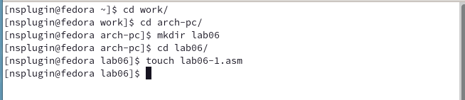{ #fig:001 width=70%, height=70% }

2. Рассмотрим примеры программ вывода символьных и численных значений. 
Программы будут выводить значения, записанные в регистр eax.

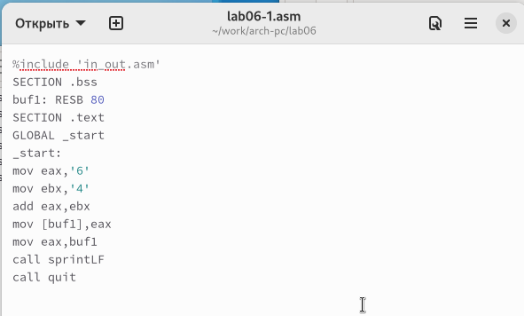{ #fig:002 width=70%, height=70% }

В данной программе (рис. [-@fig:002]) мы записываем символ '6' в регистр eax (mov eax, '6'), а символ '4' в регистр ebx (mov ebx, '4').
Затем мы добавляем значение регистра ebx к значению в регистре eax (add eax, ebx, результат сложения записывается в регистр eax).
После этого мы выводим результат.
Однако, для использования функции sprintLF, необходимо, чтобы в регистре eax был записан адрес, поэтому мы используем дополнительную переменную.
Мы записываем значение регистра eax в переменную buf1 (mov [buf1], eax),
а затем записываем адрес переменной buf1 в регистр eax (mov eax, buf1) и вызываем функцию sprintLF.

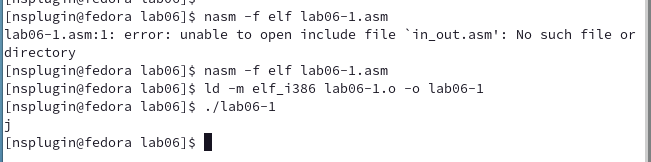{ #fig:003 width=70%, height=70% }

В данном случае, когда мы ожидаем увидеть число 10 при выводе значения регистра eax, фактическим результатом будет символ 'j'.
Это происходит из-за того, что код символа '6' равен 00110110 в двоичном представлении (или 54 в десятичном представлении),
а код символа '4' равен 00110100 (или 52 в десятичном представлении).
Когда мы выполняем команду add eax, ebx, результатом будет сумма кодов - 01101010 (или 106 в десятичном представлении),
который соответствует символу 'j'. (рис. [-@fig:003])

3. Далее изменяю текст программы и вместо символов, запишем в регистры числа. (рис. [-@fig:004])

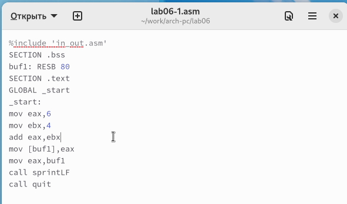{ #fig:004 width=70%, height=70% }

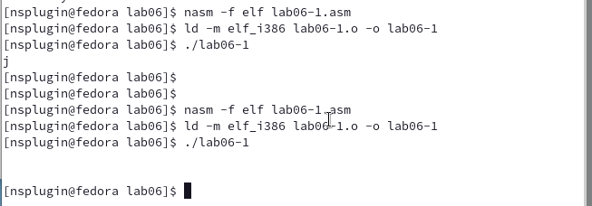{ #fig:005 width=70%, height=70% }

Как и в предыдущем случае, при выполнении программы мы не получим число 10. 
Вместо этого выводится символ с кодом 10, который представляет собой символ конца строки 
(возврат каретки). (рис. [-@fig:005])
Этот символ не отображается в консоли, но он добавляет пустую строку.

4. Как отмечалось выше, для работы с числами в файле in_out.asm реализованы 
подпрограммы для преобразования ASCII символов в числа и обратно. 
Преобразовал текст программы с использованием этих функций. (рис. [-@fig:006])

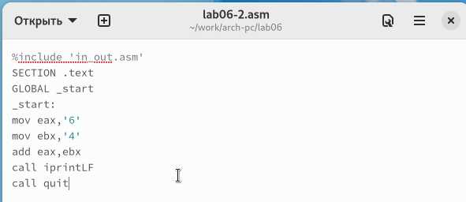{ #fig:006 width=70%, height=70% }

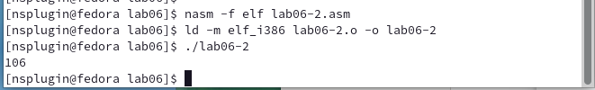{ #fig:007 width=70%, height=70% }

В результате выполнения программы мы получим число 106.  (рис. [-@fig:007])
В данном случае, как и в первом случае, команда add складывает коды символов 
'6' и '4' (54+52=106). Однако, в отличие от предыдущей программы, 
функция iprintLF позволяет вывести число, а не символ, кодом которого является это число.

5. Аналогично предыдущему примеру изменим символы на числа.(рис. [-@fig:008])

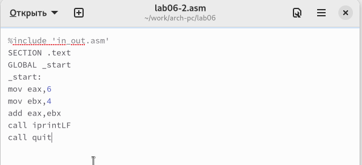{ #fig:008 width=70%, height=70% }

Функция iprintLF позволяет вывести число и операндами были числа (а не коды символов).
Поэтому получаем число 10.(рис. [-@fig:009])

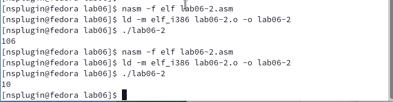{ #fig:009 width=70%, height=70% }

Заменил функцию iprintLF на iprint. Создал исполняемый файл и запустил его. 
Вывод отличается тем, что нет переноса строки.(рис. [-@fig:010])

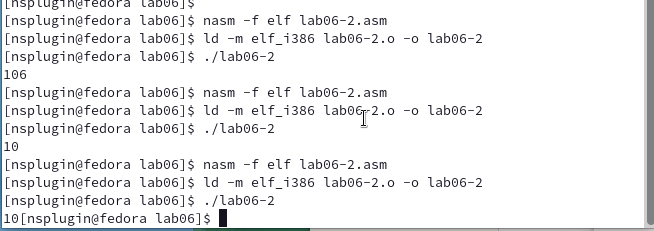{ #fig:010 width=70%, height=70% }

## Выполнение арифметических операций в NASM

6. В качестве примера выполнения арифметических операций в NASM приведем 
программу вычисления арифметического выражения (рис. [-@fig:011]) (рис. [-@fig:012])
$$f(x) = (5 * 2 + 3)/3$$.

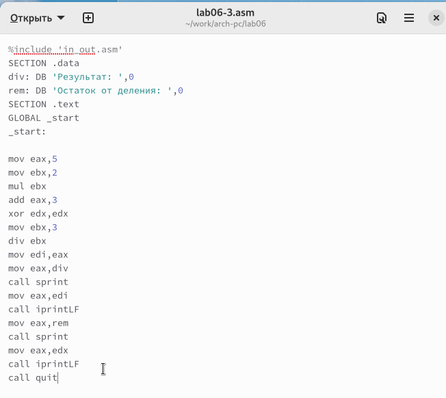{ #fig:011 width=70%, height=70% }

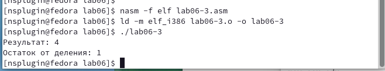{ #fig:012 width=70%, height=70% }

Изменил текст программы для вычисления выражения 
$$f(x) = (4 * 6 + 2)/5$$. 
Создал исполняемый файл и проверил его работу. (рис. [-@fig:013]) (рис. [-@fig:014])

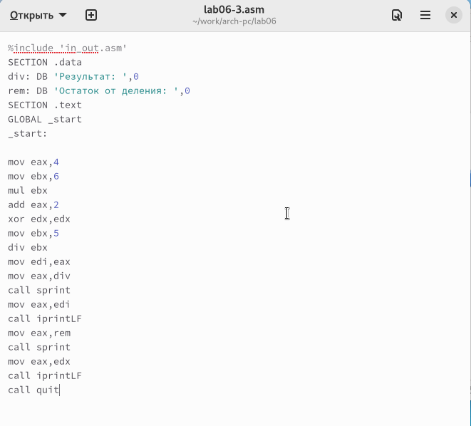{ #fig:013 width=70%, height=70% }

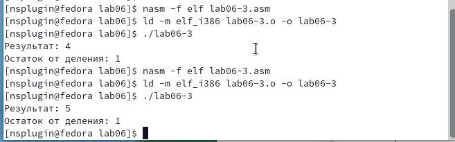{ #fig:014 width=70%, height=70% }

7. В качестве другого примера рассмотрим программу вычисления варианта задания по 
номеру студенческого билета. (рис. [-@fig:015]) (рис. [-@fig:016])

В данном случае число, над которым необходимо проводить арифметические операции,
вводится с клавиатуры. Как отмечалось выше ввод с клавиатуры осуществляется 
в символьном виде и для корректной работы арифметических операций в NASM символы 
необходимо преобразовать в числа. Для этого может быть использована функция 
atoi из файла in_out.asm.

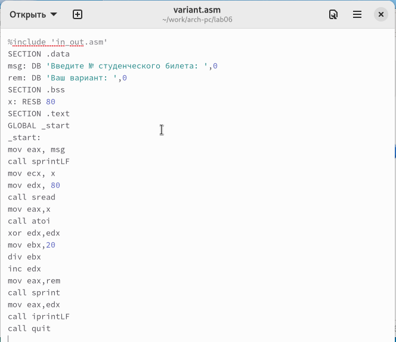{ #fig:015 width=70%, height=70% }

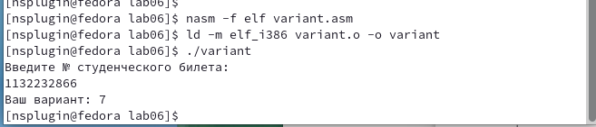{ #fig:016 width=70%, height=70% }

### Ответы на вопросы по программе variant.asm

1. Какие строки листинга отвечают за вывод на экран сообщения ‘Ваш вариант:’?

Строка "mov eax, rem" перекладывает в регистр значение переменной с фразой "Ваш вариант:"

Строка "call sprint" вызывает подпрограмму вывода строки

2. Для чего используются следующие инструкции?

Инструкция "nasm" используется для компиляции кода на языке ассемблера NASM

Инструкция "mov ecx, x" используется для перемещения значения переменной x в регистр ecx

Инструкция "mov edx, 80" используется для перемещения значения 80 в регистр edx

Инструкция "call sread" вызывает подпрограмму для считывания значения студенческого билета из консоли

3. Для чего используется инструкция "call atoi"?

Инструкция "call atoi" используется для преобразования введенных символов в числовой формат

4. Какие строки листинга отвечают за вычисления варианта?

Строка "xor edx, edx" обнуляет регистр edx

Строка "mov ebx, 20" записывает значение 20 в регистр ebx

Строка "div ebx" выполняет деление номера студенческого билета на 20

Строка "inc edx" увеличивает значение регистра edx на 1

5. В какой регистр записывается остаток от деления при выполнении инструкции "div ebx"?

Остаток от деления записывается в регистр edx

6. Для чего используется инструкция "inc edx"?

Инструкция "inc edx" используется для увеличения значения в регистре edx на 1, в соответствии с формулой вычисления варианта

7. Какие строки листинга отвечают за вывод на экран результата вычислений?

Строка "mov eax, edx" перекладывает результат вычислений в регистр eax

Строка "call iprintLF" вызывает подпрограмму для вывода значения на экран

## Самостоятельное задание

1. Написать программу вычисления выражения y = f(x). Программа должна выводить выражение 
для вычисления, выводить запрос на ввод значения x, 
вычислять заданное выражение в зависимости от введенного x, выводить результат вычислений. 
Вид функции f(x) выбрать из таблицы 6.3 вариантов заданий в соответствии с номером 
полученным при выполнении лабораторной работы. 
Создайте исполняемый файл и проверьте его работу для значений x1 и x2 из 6.3.

Получили вариант 7 - $$5(x - 1)^2$$  для $$x_{1}=3, x_{2}=5$$ (рис. [-@fig:017]) (рис. [-@fig:018])

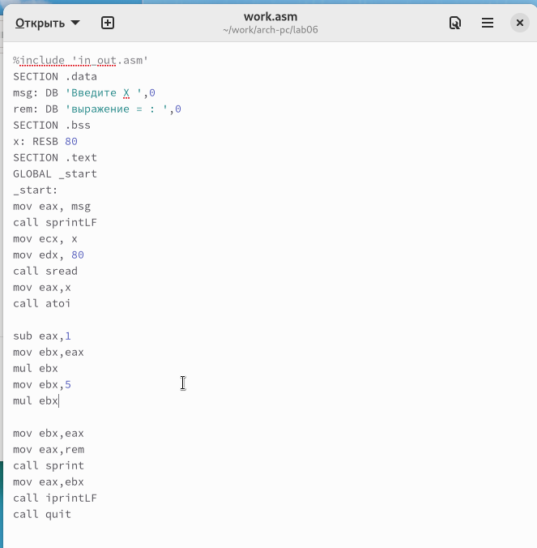{ #fig:017 width=70%, height=70% }

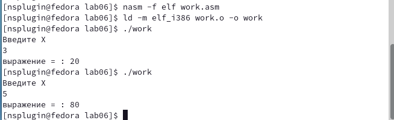{ #fig:018 width=70%, height=70% }

# Выводы

Изучили работу с арифметическими операциями.